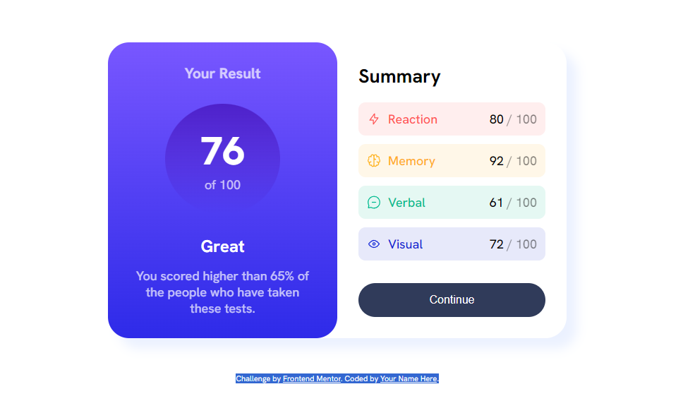
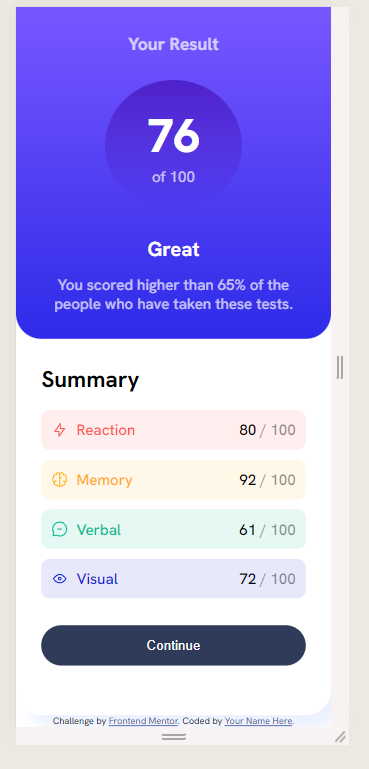

# Results Summary Component
---

## Project Description
I made this project in order to improve my HTML and CSS.
I used the site [Frontend Mentor](https://www.frontendmentor.io/challenges/results-summary-component-CE_K6s0maV) and choose the challenge "Results Summary Component".

I had to replicate the layout of the original.

This is a simple component that shows the average result of the tests performed on the left and on the right the summary has the results of each test, adn it has button in the end so the user can go to next step.

I took more time that expected to end this small project, had a difficulty in making the elemnts flexibles and resposives. I learned news things that i applied in this project. My replica is similar to the original and it responds to small devices.

I think i still have issues in organizing my css.

---
## Technologies used

I used HTML and CSS to finish this challenge.

---
## Preview

Desktop version

Mobile Version
